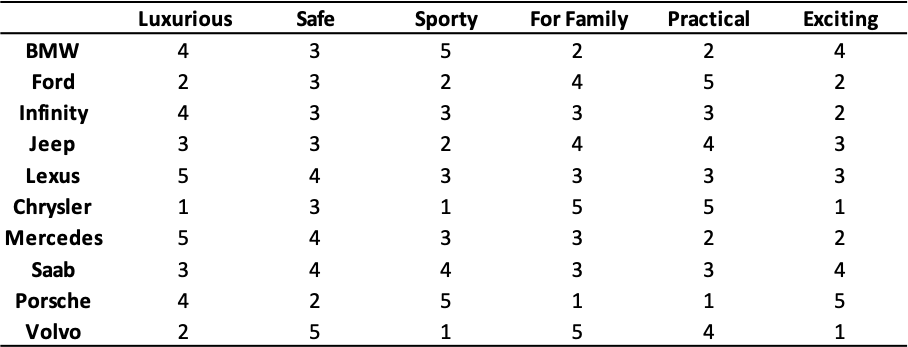
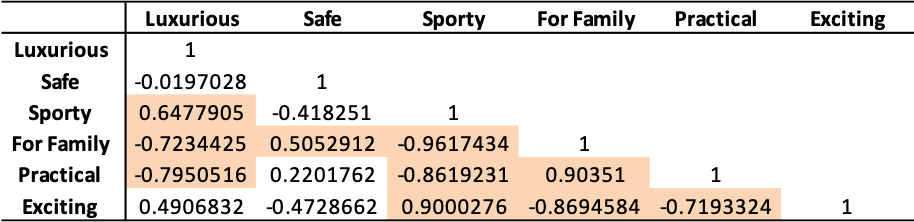
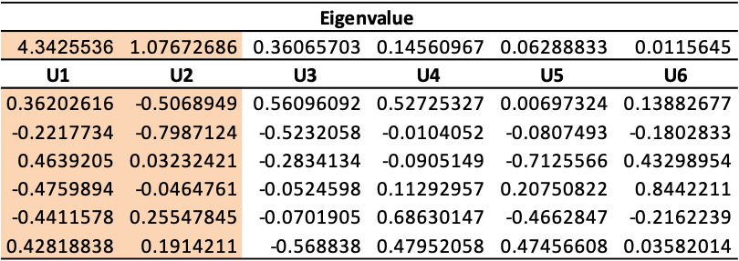
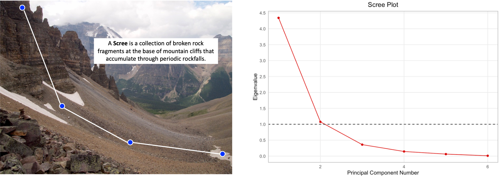
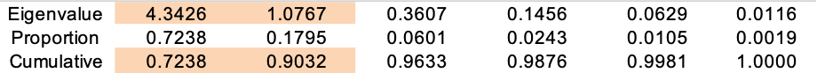
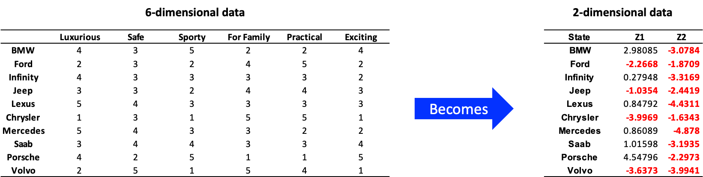
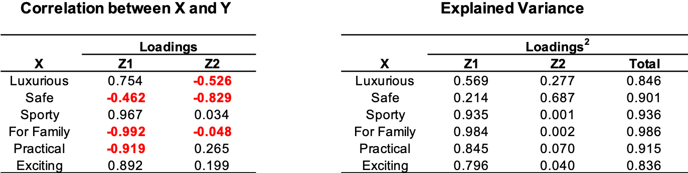
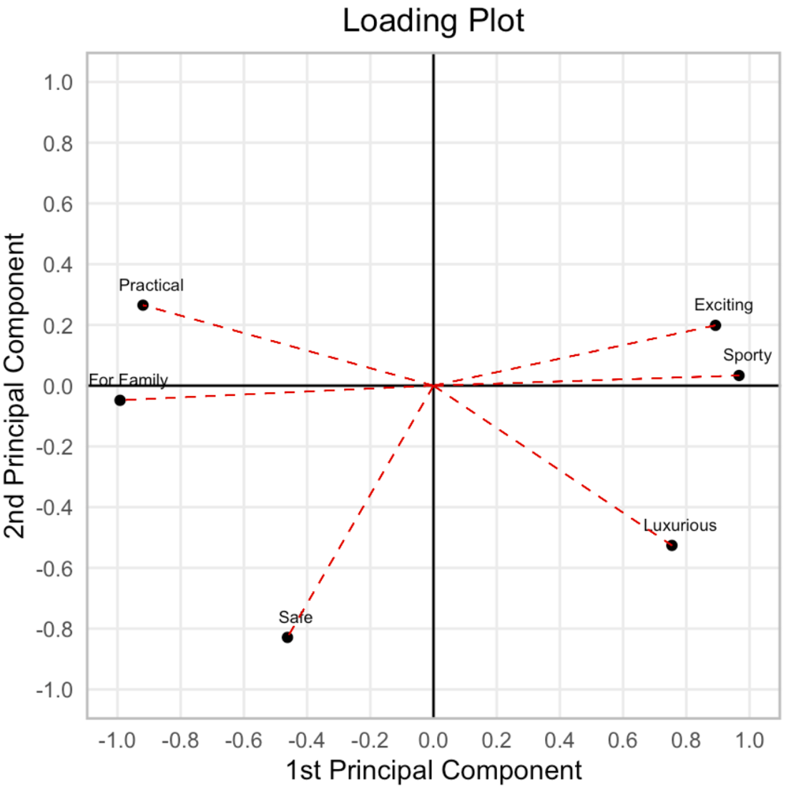
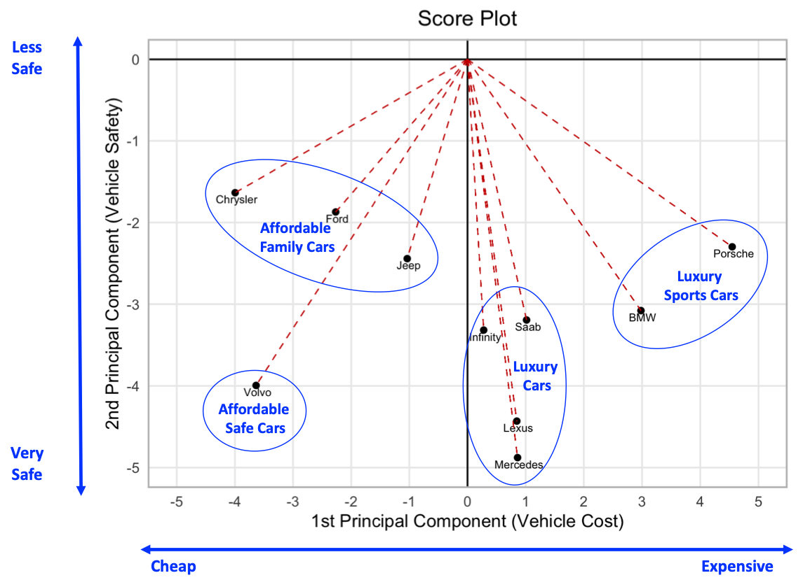

```{r setup, include=FALSE}
knitr::opts_chunk$set(
	echo = TRUE,
	message = FALSE,
	warning = FALSE#,
	#results="markup"
)
```

<style type="text/css">
.main-container {
  max-width: 800px;
  margin-left: 100px;
  margin-right: 100px;
}

.blackbox {
  padding: 1em;
  background: lightgrey;
  color: black;
  border: 1px solid black;
  border-radius: 5px;
}
</style>

<center>
{width=500}
</center>
<br>

In the following post, I describe how Principal Component Analysis (PCA) works and how it can be useful in the context of selling used cars.

Imagine for a moment you are a used-car salesman working at a car dealership that offers cars from several manufacturers.  Your dealership has tons of options to choose from, but each customer is going to be looking for something specific to their taste, personality, and budget.  Your livelihood depends on helping customers find the "right" car, but knowing the specific features of each car is a lot to ask.  On the other hand, maybe it's reasonable for you to understand the primary factors that differentiate one car brand from another.

Fortunately, Rene from the front office gave you a spreadsheet of data with ratings on how manufacturers performed across 6 categories. It looks like useful data, but some of the categories are highly ambiguous and, depending on how they are interpreted, seem redundant.  For example, what does the "For Family" rating really mean?  Mothers and fathers might view "safety" as a key feature for a family car.  Other families on a tight budget might view low-cost, "practical" purchases as being family friendly; or, perhaps, the customer is just looking for a roomy car with lots of seats, like a minivan, and views safety and practicality as completely separate categories.

```{r}
library(tidyverse)
library(readr)
library(GGally)
library(DT)
library(xtable)
options(scipen=10000)

# Load data
df <- read_csv("data/pca_data.csv") 
original_data <- df %>% select(-Manufacturer)
```

<center>
{width=500}
</center>
<br>

Fortunately, **correlation analysis** provides a means to explore relationships between the different ratings. For example, the correlation matrix below shows car ratings in the `For Family` category have a strong positive correlation with ratings in the `Safety` (0.505) and `Practicality` (0.903) categories.  In contrast, `For Family` ratings have a strong negative correlation with ratings in the `Luxury` (-0.723), `Sporty` (-0.961) and `Exciting` (-0.869) categories.  Overall, the correlation matrix reveals we are dealing with highly correlated multivariate data.  

```{r}
corr_mat <- cor(original_data)
upper<-corr_mat
upper[upper.tri(corr_mat)]<-""
upper<-as.data.frame(upper)
```

<center>
{width=500}
</center>
<br>

This is where PCA comes in handy. PCA provides a way to re-express highly correlated multivariate data in uncorrelated components that capture independent pieces of information represented in the larger data set.

Principal components (PCs) are calculated as linear combinations of multivariate data.  We determine the weights for the linear combinations and how many components to use by performing **eigenanalysis**.  As a general rule of thumb, we should only use PCs with an eigenvalue greater than 1.  In the eigenmatrix below, two eigenvalues are greater than 1. Hence, we will only use the eigenvectors in columns `U1` and `U2` to calculate the PCs.   

```{r}
Eigen_Results <- eigen(corr_mat)
eig_values <- eigen(corr_mat)$values
eig_vectors <- eigen(corr_mat)$vectors
Eigen_Matrix <- matrix(Eigen_Results$vectors,
                       ncol=length(Eigen_Results$values),
                       nrow=length(Eigen_Results$values))
tbl <- cbind(eigen(corr_mat)$values, Eigen_Matrix) %>% 
  as.tibble() %>%
  rename(`Eigen Value` = V1, 
         U1 = V2, U2 = V3, U3 = V4, U4 = V5, U5 = V6, U6 = V7)
```

<center>
{width=500}
</center>
<br>

Another technique for determining how many PCs to retain is to examine a **scree plot** of the eigenvalues.  A scree plot is is a line plot that shows eigenvalues on the y-axis and the PC number on the x-axis. Scree plots are called "scree" plots because they look like screes. 

```{r}
plot_df <- tibble(comp = 1:length(eig_values),
                  values = eig_values)

scree_plot <- ggplot(data = plot_df,
                     mapping = aes(x = comp, y = values)) +
  geom_point(color = "red3") +
  geom_line(color = "red3") +
  geom_hline(yintercept = 1, linetype="dashed") +
  labs(title = "Scree Plot",
       x = "Principal Component Number",
       y = "Eigenvalue") + 
  theme_minimal() +
  scale_x_continuous(breaks = seq(0,14,by=2)) +
  scale_y_continuous(breaks = seq(0,5,by=0.5)) +
  theme(plot.title = element_text(hjust = 0.5),
        panel.grid.minor = element_blank(),
        panel.border = element_rect(colour = "gray", fill=NA, size=1)) 
```

<center>
{}
</center>
<br>

Typically, the number of PCs we retain should be "one less than the elbow" of the scree plot.  Perhaps, a more appropriate way say this is, "find the base of the cliff, and retain the PCs that fall on the cliff face".   Regardless of which analogy we want to use, the scree plot of eigenvalues suggests we should retain 2 PCs since the "elbow" or "base of the cliff" appears to be located at the 3rd PC.

We can also take a more precise approach and analyze the eigenmatrix.  The eigenmatrix describes how much information is captured in the PCs.  In this example, the eigenmatrix indicates the first two PCs describe about 90.3% of the variation from the original 6-dimensional data, and the remaining variation can be attributed to measurement error.

```{r}
tbl <- rbind(eig_values, 
             eig_values/sum(eig_values), 
             cumsum(eig_values/sum(eig_values))) %>%
  cbind(c("Eigenvalue", "Proportion", "Cumulative")) %>%
  as.tibble() %>%
  select(Label = V7,
         U1 = V1, U2 = V2, U3 = V3, U4 = V4, U5 = V5, U6 = V6)
```

<center>
{width=600}
</center>
<br>

Next, we reduce the dimensionality of the data by transforming the 6-dimensional data to 2-dimensional data. Dimensionality reduction produces a matrix of PCs ($Z$) and is calculated by multiplying the original data ($X$) by the matrix of eigenvectors ($U$).  

<center>
$Z = XU$
</center>
<br>

On the plus side, the transformed variables are now mutually uncorrelated and account for about 90.3% of the total variance - (4.3526 + 1.076)/6 = 0.903. On the negative side, our old variable labels are no longer relevant, and we have to determine how to interpret the new variables.  

```{r}
Z <- as.matrix(original_data)%*%Eigen_Matrix
reduced_data <- Z %>% as_tibble() %>%
  select(Z1 = V1, Z2 = V2)
```

<center>
{width=700}
</center>
<br>

To determine new meaning of the PCs, it's often helpful to examining the relationship between the PCs and the original variables.  **Principal component loadings** refer to the correlations between the PCs and the original variables. We obtain the loadings ($F$) by multiplying each eigenvector $u_{i}$ by the scalar $\sqrt{\lambda_{i}}$ (i.e., the standard deviation of the i-th PC). Squaring the loading matrix allows us to determine the amount of variance in the original data captured by each of the PCs.  

Based on the table of loading values and plot of the two PC loading values, the 1st PC appears to be a classification variable that captures vehicle cost.  Safe, family, and practical cars are usually cheap and appear on the left side of the loading plot; whereas, exciting, luxurious, sporty cars are usually expensive and appear on the right. 

The interpretation of the 2nd PC is not as clear in the loading matrix or plot.  However, the table of explained variance indicates the 2nd PC captures 68.7% of the variance for the safety rating, 27.7% of the luxury rating, and almost none of the variance in the remaining rating categories. Hence, the 2nd PC appears to be related primarily to safety, which makes sense if we think about how safety relates to the other categories.  Exciting, sporty cars that go fast are not going to be as safe as a car with lots of safety features (e.g., four-wheel drive).  Likewise, practical, family cars will be less safe because additional safety features cost money.   

```{r}
# Loading Matrix
Loading_Matrix<-t(eig_vectors)*sqrt(eig_values)
Loading_Matrix<-t(Loading_Matrix)
variable_names <- colnames(df %>% dplyr::select(-Manufacturer))
explained_var <- cbind(variable_names, Loading_Matrix^2) 
colnames(explained_var) <- c("Variable", paste0(rep("Z",6), 1:6))
explained_var <- explained_var %>% as_tibble()  %>% 
  mutate(Z1 = Z1 %>% as.numeric(),
         Z2 = Z2 %>% as.numeric(),
         Z3 = Z3 %>% as.numeric(),
         Z4 = Z4 %>% as.numeric(),
         Z5 = Z5 %>% as.numeric(),
         Z6 = Z6 %>% as.numeric(),
         cum_explained_var = Z1 + Z2 + Z3 + Z4 + Z5 + Z6)
```

<center>
{width=500}
</center>
<br>

```{r, fig.width=4.5, fig.height=4.5, fig.align='center'}
plot_df <- cbind(variable_names, Loading_Matrix[,1:2]) 
colnames(plot_df) <- c("Description", "Z1", "Z2")
plot_df <- plot_df %>% as_tibble() %>%
  mutate(Z1 = Z1 %>% as.numeric(),
         Z2 = Z2 %>% as.numeric())

p <- ggplot(data = plot_df,
            mapping = aes(x = Z1, y = Z2, label = Description)) +
  geom_point() +
  geom_text(aes(label=Description),nudge_x=0.027, nudge_y=.07,
            size = 2.4) +
  geom_hline(yintercept = 0) +
  geom_vline(xintercept = 0) + 
  scale_x_continuous(breaks = seq(-1, 1, by = 0.2), 
                     limits = c(-1, 1)) +
  scale_y_continuous(breaks = seq(-1, 1, by = 0.2),
                     limits = c(-1, 1))  +
  labs(title = "Loading Plot",
       x = "1st Principal Component",
       y = "2nd Principal Component") + 
  theme_minimal() +
  theme(plot.title = element_text(hjust = 0.5),
        panel.grid.minor = element_blank(),
        panel.border = element_rect(colour = "gray", fill=NA, size=1)) 

for (i in 1:nrow(plot_df)){
p <- p + geom_segment(x = 0, y = 0, xend=plot_df$Z1[i], yend=plot_df$Z2[i],
                      linetype="dashed", color = "red3", size = 0.25) }
```

<center>
{width=450}
</center>
<br>

Based on our PCA, we believe car options can be reduced to two primary considerations, not six: 1) how much does a car cost? and 2) how safe is it?  To explore this theory, we can examine a **score plot** of PC values for the 10 manufacturers.  

```{r, fig.width=4.5, fig.height=4.5, fig.align='center'}
plot_df <- reduced_data %>% 
  mutate(Manufacturer = df$Manufacturer)

p <- ggplot(data = plot_df,
            mapping = aes(x = Z1, y = Z2, label = Manufacturer)) +
  geom_point() +
  geom_text(aes(label=Manufacturer),nudge_x=0.027, nudge_y=-.08,
            size = 2.4) +
  geom_hline(yintercept = 0) +
  geom_vline(xintercept = 0) + 
  scale_x_continuous(breaks = seq(-5, 5, by = 1), 
                     limits = c(-5, 5)) +
  scale_y_continuous(breaks = seq(-5, 0, by = 1),
                     limits = c(-5, 0))  +
  labs(title = "Score Plot",
       x = "1st Principal Component (Vehicle Cost)",
       y = "2nd Principal Component (Vehicle Safety)") + 
  theme_minimal() +
  theme(plot.title = element_text(hjust = 0.5),
        panel.grid.minor = element_blank(),
        panel.border = element_rect(colour = "gray", fill=NA, size=1)) 

for (i in 1:nrow(plot_df)){
p <- p + geom_segment(x = 0, y = 0, xend=plot_df$Z1[i], yend=plot_df$Z2[i],
                      linetype="dashed", color = "red3", size = 0.25) }
```

<center>
{width=500}
</center>
<br>

The score plot appears to confirm our intuition about how to interpret the PCs.  Luxury brands are clustered together on the right side of the plot; affordable brands are clustered together on the left.  Volvo, plotting far away from the other affordable options on safety makes sense, because Volvo's brand identity is based on its [enduring reputation for being safe]('https://wyantgroup.com/where-does-volvos-reputation-for-safety-come-from/').  Likewise, Lexus and Mercedes tend to have the highest safety ratings among luxury cars.

Now that we have sufficiently covered how PCA works, let's discuss why our PCA results are useful. PCA makes explaining the differences in car options to a customer much simpler.  For instance, the first question you should ask is:  

**"Are you interested in looking at any luxury cars today? or what price range are you looking to target today?"** 

If the customer says they have a tight budget, you probably should start by showing them a Volvo, Jeep, Ford, or Chrysler, or you might mention the 0% APR for a year sales event your dealership is offering and see if they want to check out an Infinity or Saab. If they are dressed in a suit wearing a Rolex and look like they have money to spend, maybe you should start by asking:

**"Are you looking for something fun and exciting or something that handles well in bad weather?"**  

If the customer says they want a car to impress the ladies, you probably should start by showing them a BMW or Porsche. These are the types of questions salesman ask when you visit a car dealership.  When a salesman describes a car as "Sporty", "Exciting", or "Luxurious", the implication is you're going to pay more for it.  PCA sees through the semantics and identifies the primary factor that distinguishes car options is how much are you willing to spend.

